# 🛡️ RiskLens

### AI-Powered Transaction Fraud Risk Manager

RiskLens is an explainable machine learning application that analyzes transaction data and estimates the probability of fraud.

It combines machine learning, SHAP explainability, and Streamlit to provide an interactive fraud-risk assessment dashboard.

---

## Overview

Fraud detection systems often focus only on predicting whether a transaction is fraudulent.

RiskLens goes one step further by providing:

- Fraud probability
- Risk score
- Risk classification
- Explainable AI using SHAP
- Top transaction risk factors
- Business impact estimation
- Risk recommendations

The goal is to make fraud predictions easier to understand and useful for risk-management decisions.

---

##  Key Features

- **Fraud Prediction** — Estimates the probability that a transaction is fraudulent.
- **Risk Score** — Converts fraud probability into a 0–100 risk score.
- **Risk Classification** — Categorizes transactions as Low, Medium, or High risk.
- **SHAP Explainability** — Explains which features influenced the prediction.
- **Risk Factor Visualization** — Shows the most influential transaction features.
- **Business Impact Analysis** — Estimates potential operational review impact.
- **Interactive Dashboard** — Built using Streamlit.

---

## 🚦 Risk Classification

| Risk Score | Risk Level |
|------------|------------|
| < 40 | 🟢 LOW RISK |
| 40–69 | 🟡 MEDIUM RISK |
| ≥ 70 | 🔴 HIGH RISK |

---

##  Machine Learning Workflow

```text
Transaction Input
       ↓
Data Preprocessing
       ↓
Feature Transformation
       ↓
Machine Learning Model
       ↓
Fraud Probability
       ↓
Risk Score (0–100)
       ↓
Risk Classification
       ↓
SHAP Explanation
       ↓
Business Risk Decision

---

# 📸 Dashboard Screenshots

## Dashboard

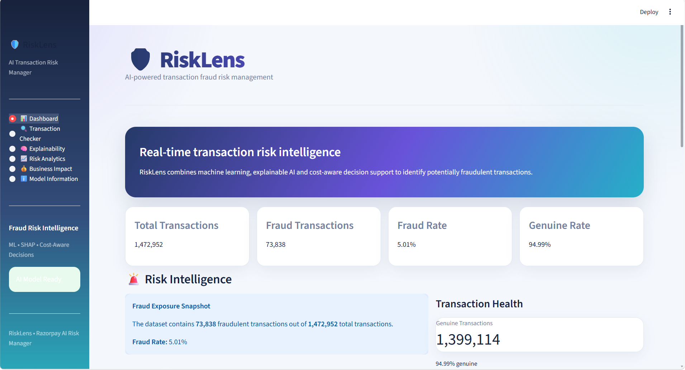

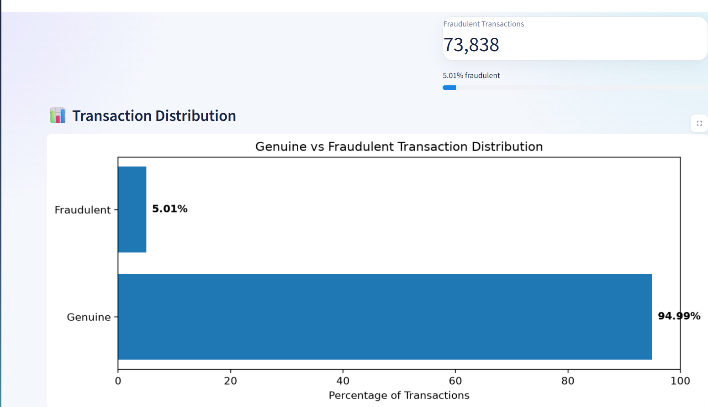

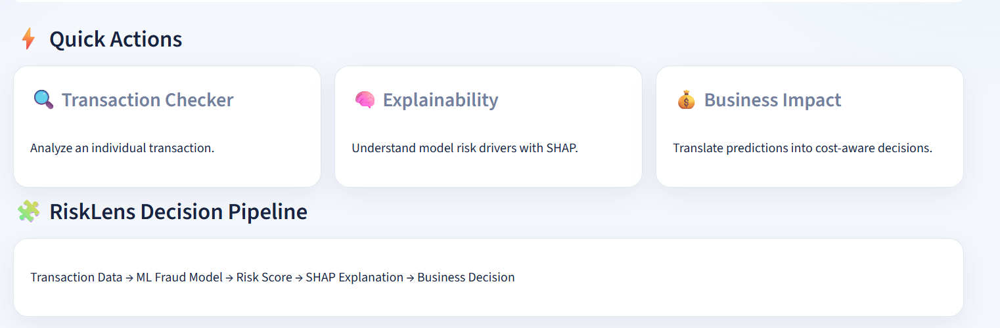

---

## Transaction Checker

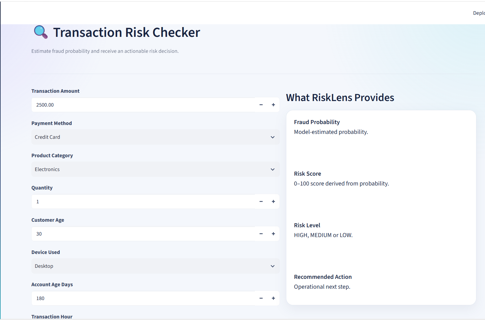

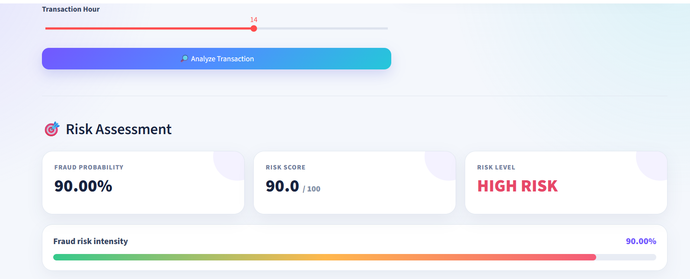

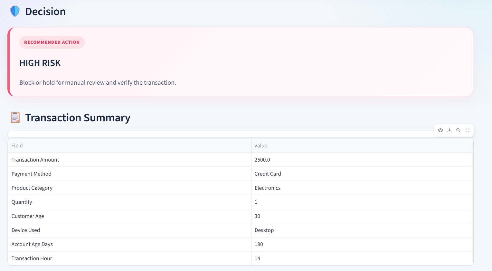

---

## Explainability

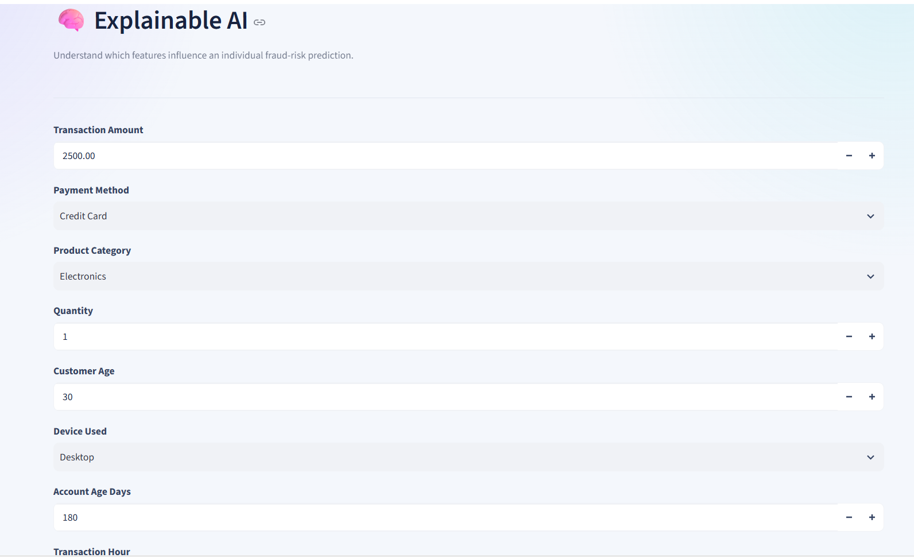

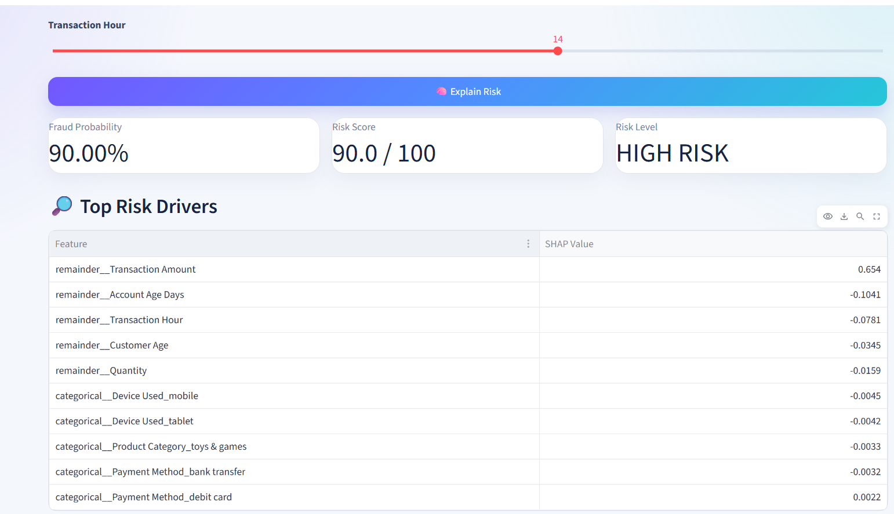

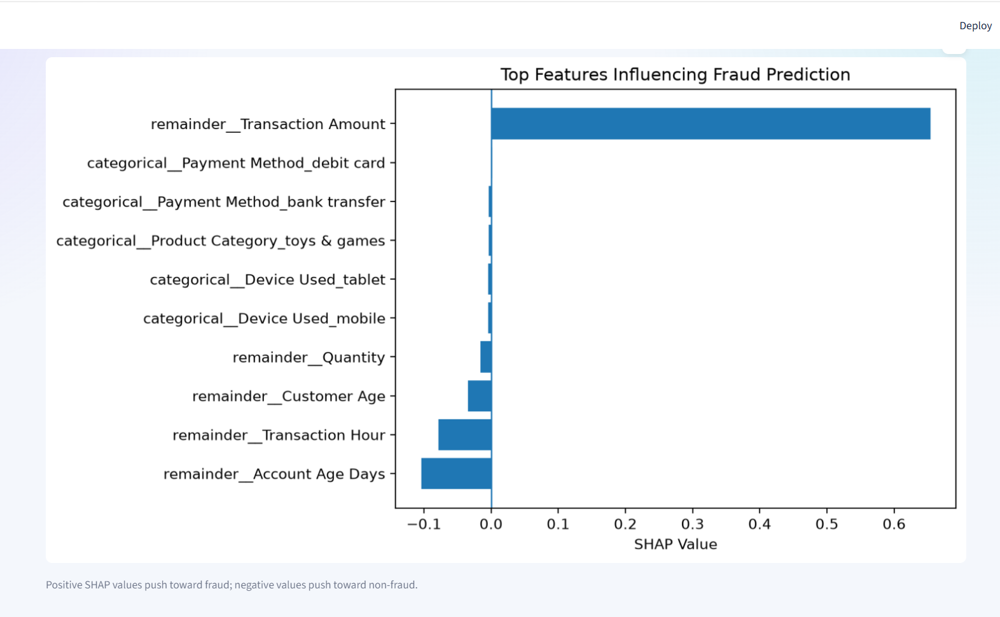

---

## Risk Analytics

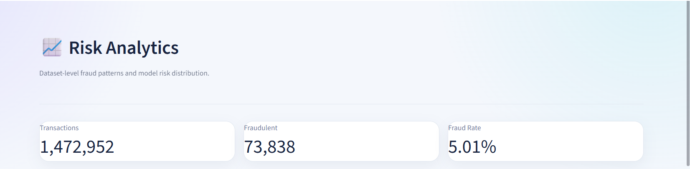

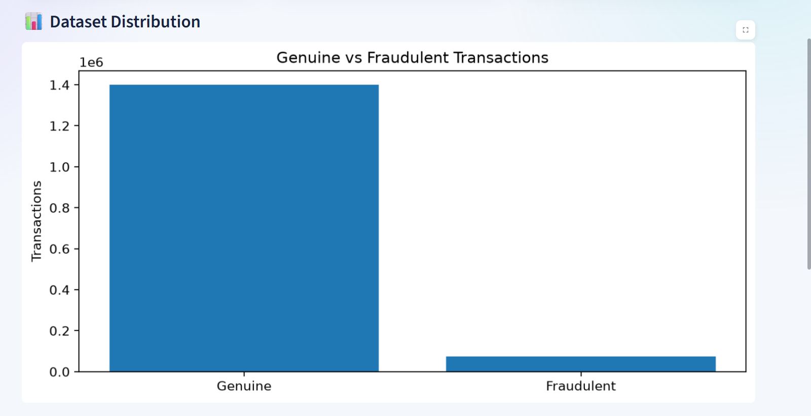

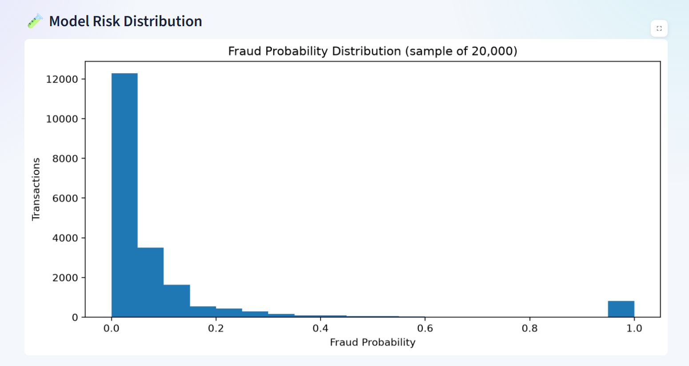

---

## Business Impact

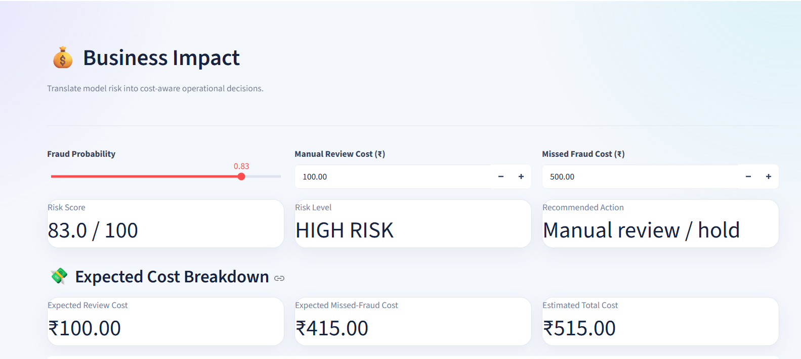

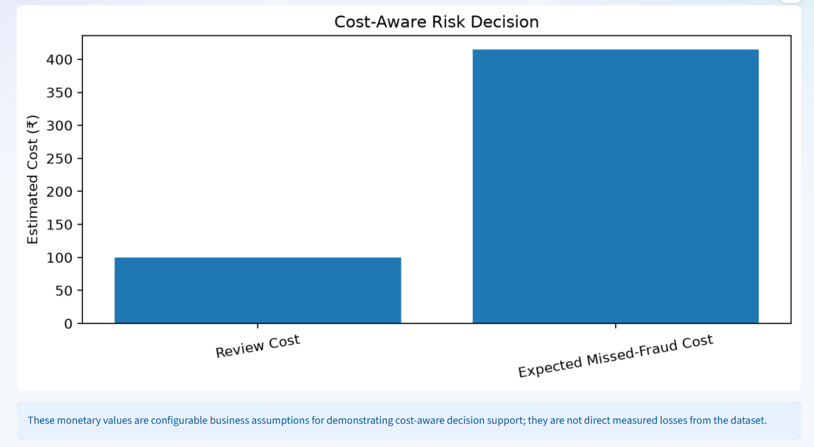

---

## Model Information


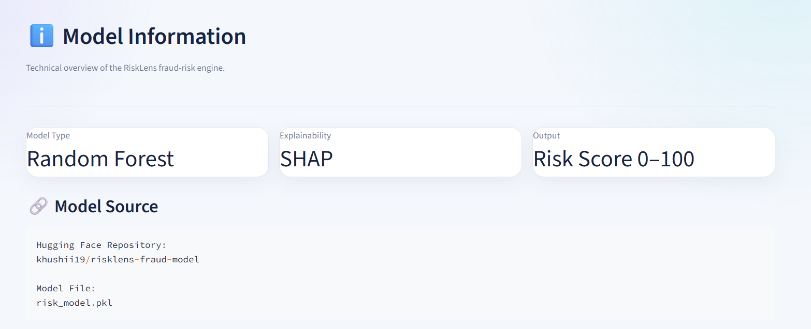

